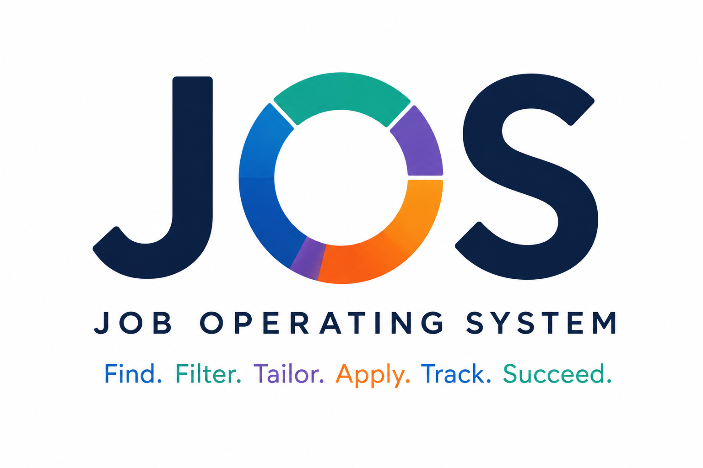
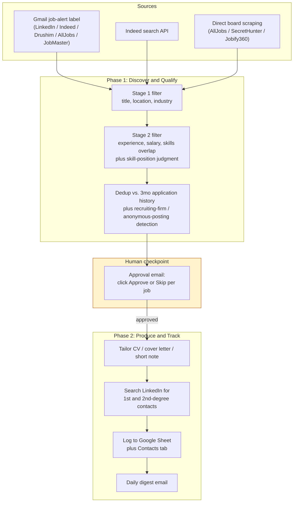

# JOS (Job Operating System)

**An agentic automation pipeline that sources, filters, and prepares job applications, while I make every actual decision.**

This repo documents the design and code of a personal production system I built and run daily during my own job search. The real pipeline lives in a private repo (it touches my Gmail, my Google Sheet, my LinkedIn account); this is a sanitized writeup plus representative code, for anyone curious how it actually works.

---

## The problem

Job searching at volume means the same repetitive loop, several times a day: open Gmail, scan a dozen job-alert emails, open each posting, re-read the requirements, decide if it's worth pursuing, check whether you already applied, and, if it's a yes, write a tailored CV and find someone at the company to reach out to. Most of that loop is mechanical. A little of it needs real judgment (is "Python" in this JD a hard requirement or a nice-to-have buried in paragraph six?). The mechanical part is exactly what should be automated. The judgment part is exactly what usually isn't, because it's hard to hardcode.

## What JOS actually is

JOS is a two-phase pipeline, triggered on demand from a small local web app. It is **not** a scheduled cron job, and **not** an auto-apply bot. It finds and qualifies postings, drafts the paperwork, and puts everything in front of me for a final yes/no. Nothing is ever submitted automatically.

The distinguishing design choice: the parts of this that need judgment (does this JD actually require Python, or is it a soft "nice to have"? Is this a recruiting firm reposting the same role under three different anonymous listings?) are handled by a **Claude Code agent reasoning over structured, versioned rules**, not a keyword scorer. The parts that are purely mechanical (parsing dates, deduplicating against application history, writing Sheet rows) stay in ordinary, deterministic Node.js. Drawing that line correctly is most of what makes the system reliable instead of flaky.

## Architecture

**Reliability, not just happy-path:** a watchdog thread emails and desktop-notifies me if a run goes silent for 20+ minutes. Session-refresh scripts recover from LinkedIn/board bot-walls and expired logins without losing the run. Every job-board fetch runs through a tiered pipeline (pre-fetched JD, then an email snippet, then a live fetch) so a blocked site degrades gracefully instead of losing the job entirely.

## Design decisions (the interesting part)

**Two-stage filtering, not one.** Stage 1 is cheap and mechanical: title keywords, location bounds, industry exclusions, and it discards the obvious no's before anything expensive happens. Stage 2 only runs on survivors, and does the actual judgment work: experience thresholds, skills overlap, and a **skill-position filter** that looks at *where* a skill appears in the requirements list and *how* it's phrased. "Tableau" as the first bullet under "Requirements" is a hard filter. "Familiarity with Tableau" in bullet six under "nice to have" isn't. A plain keyword match can't tell the difference; an agent reading the paragraph can.

**Recruiting firms need different dedup logic than direct employers.** A recruiter reposts the same underlying role across boards under different listing IDs, but also sometimes reposts the *literal same* posting later. The system tells these apart by company-name pattern plus a same-role similarity check (title, location, and JD overlap) across everything queued in one run, so the same job doesn't quietly enter the pipeline twice under two different anonymous listings.

**Documents get generated before the contact search, on purpose.** If a run gets cut short partway through Phase 2, the CV and cover letter are already usable. Contact search is a nice-to-have layered on top, not a dependency.

**No auto-apply, by design.** The pipeline's job ends at a reviewable draft and a logged row. I read every JD it flagged, and I click send. That's a deliberate boundary, not a missing feature: the point is to remove the repetitive scanning and drafting, not the judgment of what to apply to.

## Stack

- **Orchestration:** Node.js + Express backend, React frontend, a small local web app that triggers and monitors runs
- **Reasoning engine:** Claude Code (Claude Sonnet), driven by versioned instruction files, not a single monolithic prompt. Discovery, qualification, and document generation are separate, independently-tuned rule sets
- **Integrations, via MCP (Model Context Protocol):** Gmail, Google Sheets, Google Docs, a stealth Playwright browser for job-board fetching and LinkedIn contact search, Indeed's search API
- **Reliability layer:** a stuck-run watchdog, and session-expiry auto-recovery for LinkedIn/job-board logins

## Code

The real pipeline is private (personal Gmail/Sheet/LinkedIn access baked throughout), but [`examples/`](examples/) has three representative, sanitized excerpts:

- [`skill_position_filter.md`](examples/skill_position_filter.md): the actual agent instruction set for the "is this skill really a hard requirement" judgment call described above
- [`dedup_retention.js`](examples/dedup_retention.js): real code, how application history is capped and deduplicated without losing repost-detection
- [`tiered_jd_fetch.js`](examples/tiered_jd_fetch.js): real code, the fallback chain a job-description fetch goes through before a blocked site costs you the listing entirely

---

📬 [LinkedIn](https://linkedin.com/in/OferStrauss) · ofer.strauss@gmail.com
